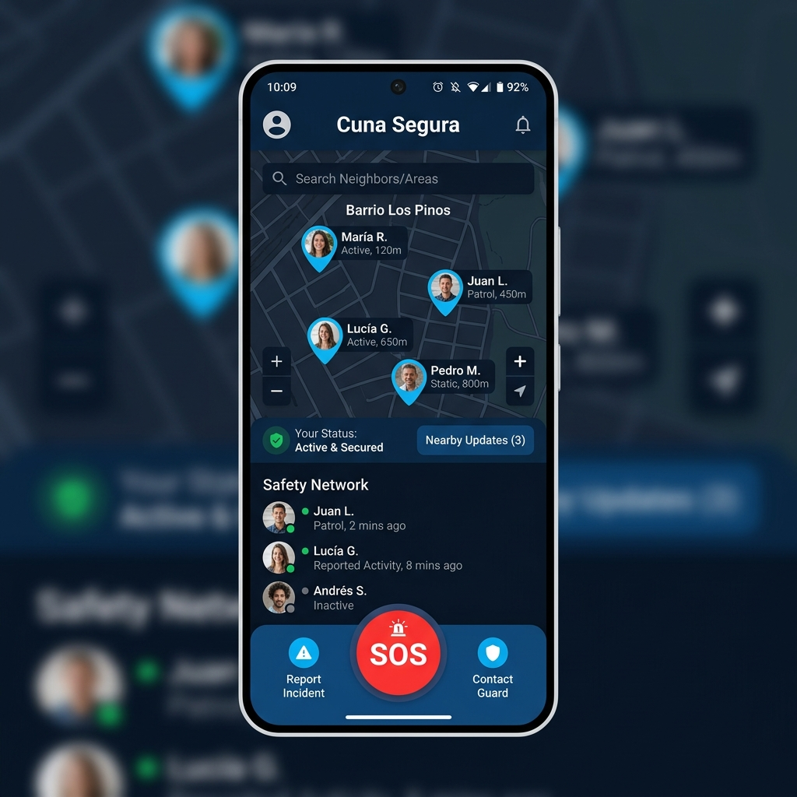
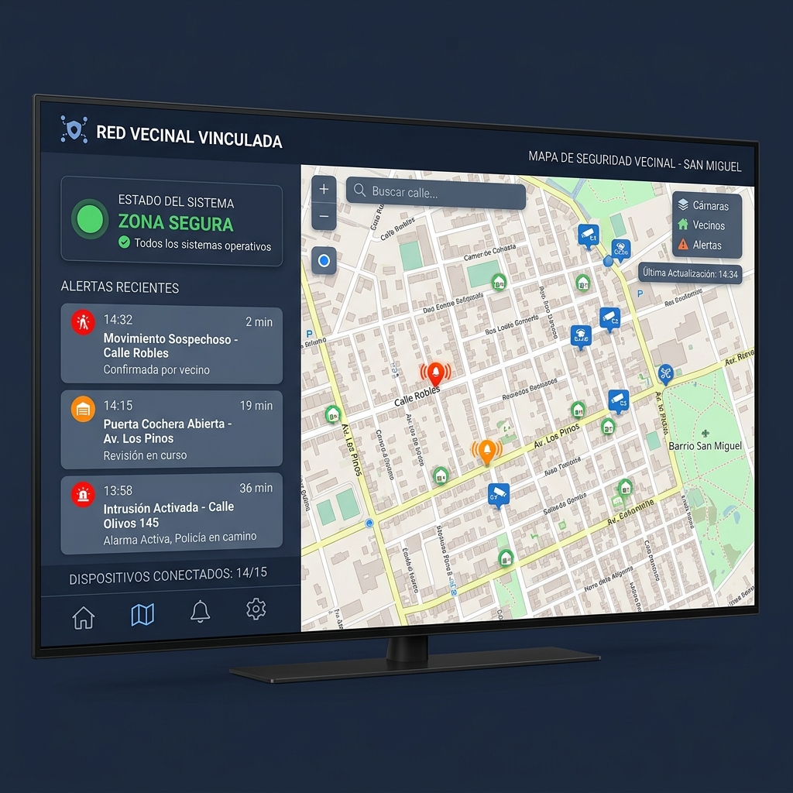

# Cuna Segura - Sistema de Monitoreo Vecinal

Cuna Segura es una solución integral orientada a la seguridad ciudadana y la coordinación vecinal. El proyecto se compone de múltiples interfaces y módulos que interactúan en tiempo real mediante MQTT y Firebase para garantizar tiempos de respuesta rápidos y comunicación confiable.

## 📱 Módulo Móvil (Mobile App)
La aplicación principal de teléfono está diseñada para ser la herramienta que el vecino llevará siempre consigo.
- **Reporte Rápido**: Cuenta con botones de Pánico/SOS para emitir alertas inmediatas.
- **Geolocalización en Tiempo Real**: Visualización en mapas interactivos para localizar la alerta y coordinar ayuda.
- **Red Vecinal**: Gestión de redes de vecinos, en donde se asignan roles y permisos.
- **Modo Oscuro Integrado**: Tematización responsiva usando Material Design 3 en tonos azul medianoche.

## 📺 Módulo TV (Smart TV Dashboard)
Diseñado específicamente para centros de monitoreo, casetas de vigilancia o simplemente como una central de visualización en pantallas grandes (1080p y 4K).
- **Vista Cinemática (Dashboard)**: Interfaz estructurada para ser legible a la distancia con colores contrastantes y responsividad total.
- **Panel Lateral Dinámico**: Ocupa el 40% de la pantalla para mostrar las alertas recientes y estados críticos. Completamente colapsable y animado para expandir el mapa al 100%.
- **Mapas de OSMDroid Optimizados**: El mapa interactivo ha sido calibrado con ciclos de vida y User-Agents específicos para Android TV, permitiendo visualizar los incidentes al instante.
- **Alertas Claras**: Tarjetas grises/azules (`surfaceVariant`) que resaltan contra el fondo para evitar confusiones y no perder de vista los eventos de la base de datos (MQTT/Firebase).

## ⌚ Módulo Wear OS (Smartwatch)
Una aplicación ligera para relojes inteligentes. Permite a los vecinos recibir notificaciones directas en su muñeca y disparar alertas de emergencia con un par de toques, sin necesidad de sacar el teléfono celular del bolsillo.

---
### Arquitectura y Tecnologías
* **Frontend**: Jetpack Compose (Compose for TV, Compose for Wear OS).
* **Backend**: Firebase Realtime Database para la sincronización de nodos y cuentas de usuarios.
* **Comunicaciones**: MQTT protocol (ideal para IoT y microcontroladores tipo ESP32).
* **Tematización**: Tema unificado (Dark Blue) implementado a lo largo de todos los módulos usando esquemas semánticos de `MaterialTheme.colorScheme`.

---
*Cuna Segura - Cuidando a los nuestros, siempre conectados.*
