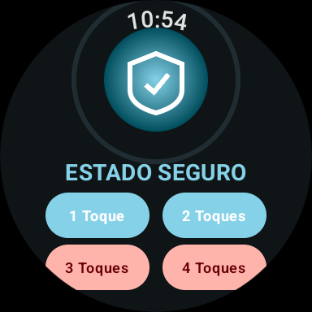
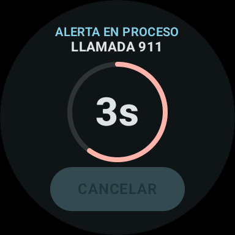
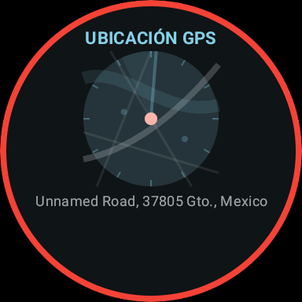

# 🛡️ Cuna Segura

> Red de seguridad vecinal interconectada para Android — Alerta de emergencia rápida y discreta desde cualquier dispositivo del ecosistema.

---

## 📋 Datos del Proyecto

| Campo | Detalle |
|---|---|
| **Nombre del Proyecto** | Cuna Segura |
| **Materia** | Desarrollo de Aplicaciones para Dispositivos Inteligentes |
| **Grupo** | GIDS6092 |

---

## 👥 Integrantes

| Nombre |
|---|
| Brandon Gustavo Mendoza Amaro |
| Karen Anahí Padrón Martínez |
| Lizeth Ramírez Ramírez |

---

## 🎯 Objetivo

El objetivo de **Cuna Segura** es crear una red de seguridad vecinal interconectada para Android que permita a los usuarios activar alertas de emergencia de forma **rápida y discreta**. El sistema busca cerrar la brecha de respuesta ante situaciones de peligro, coordinando el uso de tres dispositivos (móvil, smartwatch y Smart TV) para asegurar que el usuario siempre tenga una forma de pedir auxilio, gestionando la lógica de forma **local** en los dispositivos, priorizando la privacidad.

---

## ✨ Descripción de Funcionalidades

El ecosistema de Cuna Segura se basa en **tres pilares interconectados** que operan de manera local. Puedes consultar la documentación detallada y visual de cada uno a continuación:

* 📱 **[Módulo Móvil (Teléfono)](docs/MOBILE.md)**: El hub central. Gestión de contactos, redes vecinales, alertas SOS manuales y geolocalización.
* 📺 **[Módulo Smart TV (Centro de Monitoreo)](docs/TV.md)**: Dashboard cinemático diseñado para pantallas grandes. Muestra mapas y alertas en tiempo real al 100% de responsividad.
* ⌚ **[Módulo Wear OS (Smartwatch)](docs/WEAROS.md)**: Aplicación ultra rápida para activar alertas de pánico desde la muñeca mediante toques físicos.

### 📱 Hub Central (Teléfono)
- Gestión de contactos de emergencia personalizados.
- Configuración de alertas y acciones por número de toques.
- Vinculación local vía **Bluetooth Low Energy (BLE)** con el smartwatch.
- Visualización de mapa con marcadores diferenciados (azul = usuario, rojo = vecino en peligro).
- Panel de administración (ícono de escudo) para gestión interna y configuración de red.

### ⌚ Botón de Pánico (Smartwatch — Wear OS)
- Activación de alertas discretas mediante un sistema configurable de **1 a 4 toques** físicos.
- Base de datos Room local con configuración precargada de acciones por toque.
- Rastreo GPS en tiempo real con geocodificación de dirección física.
- Pantalla de cuenta regresiva de **5 segundos** (cancelable) anti-falsas alarmas.
- Interfaz de **Chequeo de Vida** con efecto glassmorphism ("¿ESTÁS BIEN?").

### 📺 Central de Monitoreo (Smart TV)
- Recibe y muestra notificaciones de alerta de vecinos mediante comunicación directa entre dispositivos.
- Permite visualizar la ubicación de quien activó la alerta con mapas optimizados.

### 🔧 Sistema de Acciones
Cuatro acciones personalizables asociadas al número de toques:
1. Enviar mensaje de auxilio
2. Compartir ubicación GPS
3. Activar alarma en TV del vecino
4. Llamar al 911

### 🛡️ Anti-Falsas Alarmas (3 capas de seguridad)
1. **Confirmación:** Ventana de 5 segundos para cancelar la alerta.
2. **Verificación de Vida:** Chequeo automático cada 2 minutos durante SOS activo.
3. **Reporte Vecinal:** Los vecinos pueden reportar falsa alarma desde su dispositivo.

### 🌐 Red Vecinal
- Conexiones mutuas directas mediante **GPS** (radio de 200 m) o escaneo de **código QR**.
- Arquitectura peer-to-peer para garantizar privacidad y control local sin servidores externos.

---

## 🛠️ Tecnologías Utilizadas

| Categoría | Tecnología |
|---|---|
| **Lenguaje** | Kotlin 2.4.0 |
| **UI Móvil** | Jetpack Compose |
| **UI Wear OS** | Jetpack Compose for Wear OS |
| **UI Smart TV** | Leanback Library |
| **Almacenamiento Local** | Jetpack DataStore / Room |
| **Mapas** | Google Maps SDK |
| **Conectividad** | Android BLE API (Bluetooth Low Energy) |
| **Gestión Asíncrona** | Coroutines + Flow |
| **Inyección de Dependencias** | Hilt |
| **Arquitectura** | MVVM + Repository Pattern |
| **Geolocalización** | LocationManager + Geocoder |

---

## 🚀 Instrucciones para Ejecutar el Proyecto

### Requisitos Previos
- Android Studio **Meerkat** (2024.3) o superior.
- JDK 17.
- Android SDK con API Level **30+** (para el módulo móvil).
- Wear OS SDK (API Level **30+**) para el módulo del reloj.
- Un emulador Wear OS configurado en AVD Manager, o un reloj físico con Wear OS conectado via ADB.

### Clonar el Repositorio
```bash
git clone https://github.com/gus-p3/CunaSegura.git
cd CunaSegura
```

### Abrir en Android Studio
1. Abrir Android Studio.
2. Seleccionar **File → Open** y navegar a la carpeta clonada.
3. Esperar a que Gradle sincronice las dependencias.

### Ejecutar el Módulo Móvil (`:app`)
1. En la barra superior de Android Studio, seleccionar la configuración **`app`**.
2. Seleccionar un emulador o dispositivo Android físico (API 30+).
3. Presionar **▶ Run**.

O desde la terminal (PowerShell):
```powershell
.\gradlew :app:installDebug
```

### Ejecutar el Módulo Wear OS (`:cunasegurawear`)
1. En Android Studio, cambiar la configuración de ejecución a **`cunasegurawear`**.
2. Seleccionar un emulador Wear OS o reloj físico conectado.
3. Presionar **▶ Run**.

O desde la terminal:
```powershell
# Compilar APK de debug
.\gradlew :cunasegurawear:assembleDebug

# Instalar directamente en emulador/reloj conectado
.\gradlew :cunasegurawear:installDebug
```

### Compilar todos los módulos
```powershell
.\gradlew assembleDebug
```

### Nota sobre configuración Kotlin / Room
El proyecto usa Kotlin `2.4.0`. Para evitar incompatibilidades del compilador de anotaciones de Room (`kapt`), se forzó la versión del parser de metadatos en el módulo Wear:
```kotlin
// cunasegurawear/build.gradle.kts
configurations.all {
    resolutionStrategy {
        force("org.jetbrains.kotlin:kotlin-metadata-jvm:2.4.0")
    }
}
```

---

## 📸 Capturas de Pantalla

> Capturas tomadas en el emulador **Wear OS (384×384)** con la app en ejecución real.

| Pantalla | Descripción |
|---|---|
|  | **Estado Seguro** — Pantalla principal con los 4 botones de acción |
|  | **Cuenta Regresiva** — 5 segundos para cancelar (acción 3 toques) |
|  | **Ubicación GPS** — Mapa con dirección en tiempo real (alerta activa) |
|  | **Compartiendo GPS** — Transmisión de ubicación a contactos |
|  | **Status Screen** — Pantalla principal completa con reloj |
|  | **Llamada 911** — Cuenta regresiva para llamada de emergencia (4 toques) |
|  | **GPS Alerta Activa** — GPS con borde rojo (modo SOS activo) |

> Las capturas también se encuentran en la carpeta [`/evidencias`](./evidencias/).

---

## 📁 Estructura del Repositorio

```
CunaSegura/
├── app/                        # Módulo principal (Android Móvil)
│   └── src/main/
│       ├── java/               # Código fuente Kotlin (MVVM + Hilt)
│       └── res/                # Recursos (layouts, drawables, strings)
├── cunaseguratv/               # Módulo Smart TV
│   └── src/main/
│       └── java/               # Código fuente Compose for TV
├── cunasegurawear/             # Módulo Wear OS (Smartwatch)
│   └── src/main/
│       └── java/               # Código fuente Compose for Wear OS
├── docs/                       # Documentación específica por módulo (TV, Wear, Mobile)
├── evidencias/                 # Capturas de pantalla de la aplicación
├── assets/                     # Mockups generados
├── apk/                        # APKs generados de la aplicación
├── build.gradle.kts            # Configuración raíz de Gradle
├── settings.gradle.kts         # Configuración de módulos
└── README.md                   # Este archivo
```

---

## 📦 APK

El archivo APK generado se encuentra en la carpeta [`/apk`](./apk/).

---

## 🎨 Paleta de Colores

| Rol | Color | Hex |
|---|---|---|
| **Primario (Cian)** | Estado Seguro / Títulos | `#85D1E8` |
| **Fondo / Superficie** | Gris grafito profundo (OLED) | `#0F1416` |
| **Alerta / Error** | Rojo suave (SOS / Advertencias) | `#FFB4AB` |

