# 📱 Cuna Segura - Módulo Móvil (Smartphone App)

## 1. Introducción al Proyecto
La aplicación móvil de Cuna Segura representa el pilar central (Hub Central) del ecosistema de seguridad ciudadana. Diseñada para dispositivos Android, su principal objetivo es brindar una interfaz accesible y rápida para que los usuarios puedan enviar alertas SOS, gestionar sus redes vecinales, configurar dispositivos vinculados (como relojes inteligentes Wear OS y Smart TVs), y mantenerse al tanto de emergencias comunitarias en tiempo real.
Este documento detalla exhaustivamente todas las pantallas, funcionalidades, reglas de negocio y arquitecturas implementadas en la aplicación de smartphone.

---

## 2. Pantallas de Autenticación y Registro

El primer punto de contacto de la aplicación móvil es el flujo de autenticación, que garantiza que solo los miembros autorizados o vecinos registrados puedan interactuar con la red comunitaria.

### 2.1. Inicio de Sesión (Login)
La pantalla de inicio de sesión permite a los usuarios acceder a su cuenta. Utiliza Firebase Authentication para asegurar los credenciales.
- **Campos**: Correo Electrónico, Contraseña (con botón para mostrar/ocultar).
- **Validaciones**: Se verifica el formato de correo y longitud mínima de contraseña.
- **Imagen de Referencia**:
  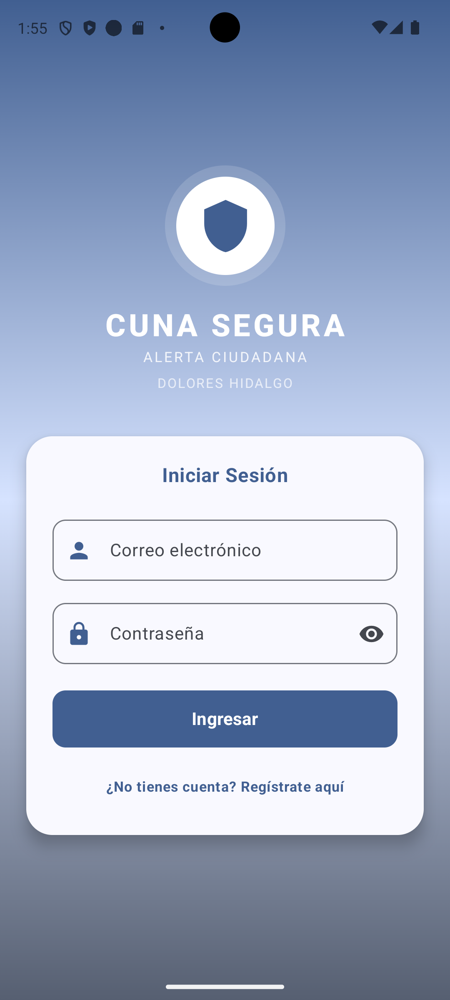

### 2.2. Registro de Usuario (Sign Up)
Para nuevos usuarios, la pantalla de registro solicita los datos necesarios para integrarse a la comunidad.
- **Campos**: Nombre Completo, Teléfono a 10 dígitos (usado para contactos de emergencia), Correo, Contraseña, y Confirmar Contraseña.
- Al registrarse, el usuario automáticamente recibe un perfil básico de tipo "Vecino" en la base de datos (Room y Firebase).
- **Imagen de Referencia**:
  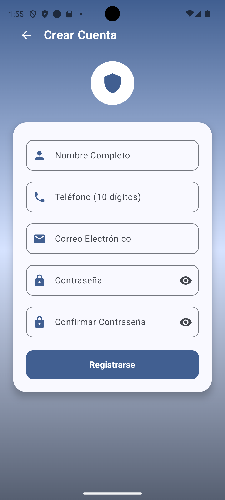

---

## 3. Flujo del Usuario Normal (Vecino)

Una vez autenticado, el usuario normal ("Vecino") entra al corazón de la aplicación. Esta sección describe sus capacidades y vistas.

### 3.1. Dashboard Principal (Botón SOS)
Esta es la pantalla principal o de inicio, diseñada para acciones de respuesta rápida.
- **Botón SOS Central**: Un botón rojo de gran tamaño diseñado para activarse en situaciones de pánico. Requiere mantener presionado por 3 segundos para evitar pulsaciones accidentales ("falsas alarmas").
- **Accesos directos de emergencia**:
  - **911 / Policía**: Redirige al marcador telefónico con el 911 pre-cargado.
  - **Ambulancia IMSS / Cruz Roja**: Marcación rápida para emergencias médicas.
  - **Bomberos**: Llama directamente al departamento de bomberos local.
  - **Mi Ubicación**: Centra el mapa en la ubicación GPS exacta actual del usuario.
- **Imagen de Referencia**:
  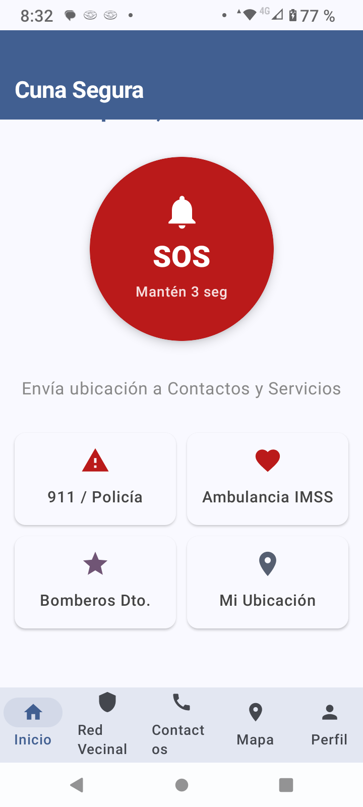

### 3.2. Mapa Comunitario
Una de las funcionalidades más potentes es el seguimiento de incidencias y de miembros en tiempo real a través de Google Maps.
- El mapa muestra la ubicación actual del usuario mediante el GPS activo (Icono azul/estrella).
- Si hay miembros de la red cercanos, se muestran con marcadores verdes ("Vecinos").
- Si existe una alerta SOS activa, se renderiza con un marcador rojo parpadeante o de peligro.
- Cuenta con un panel inferior que resume el estado ("Todo está en calma" o listado de emergencias).
- **Imágenes de Referencia**:
  - Mi Ubicación:
    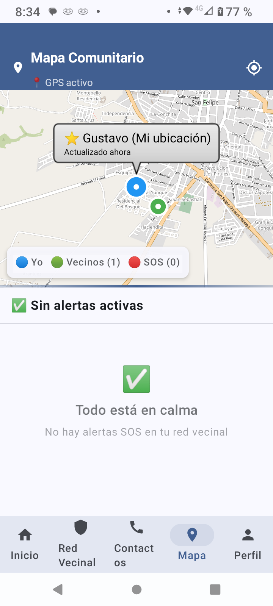
  - Ubicación de un Vecino:
    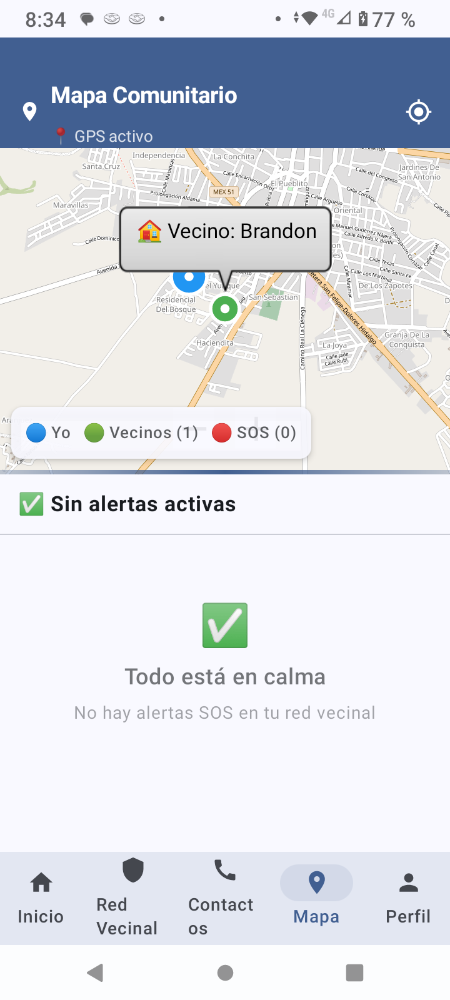

### 3.3. Red Vecinal (Modo Usuario)
El usuario puede ver a qué red pertenece y el código QR de invitación si la red es abierta.
- Visualización de la cobertura del polígono de la colonia.
- Lista de miembros actualmente conectados.
- Identificador personal.
- **Imagen de Referencia**:
  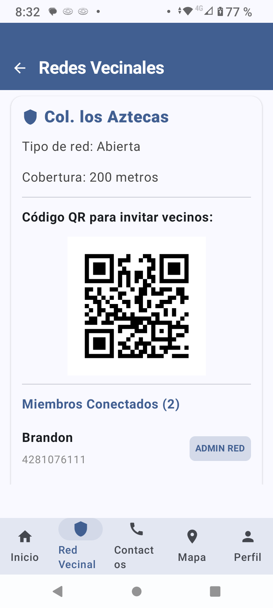

### 3.4. Contactos de Confianza
Sección vital donde el usuario registra a familiares o personas cercanas que serán notificadas por SMS o llamada en caso de activar una alarma SOS.
- Permite añadir, editar y eliminar (mediante un icono de basurero rojo) contactos.
- La información incluye nombre completo, relación y número de teléfono.
- **Imagen de Referencia**:
  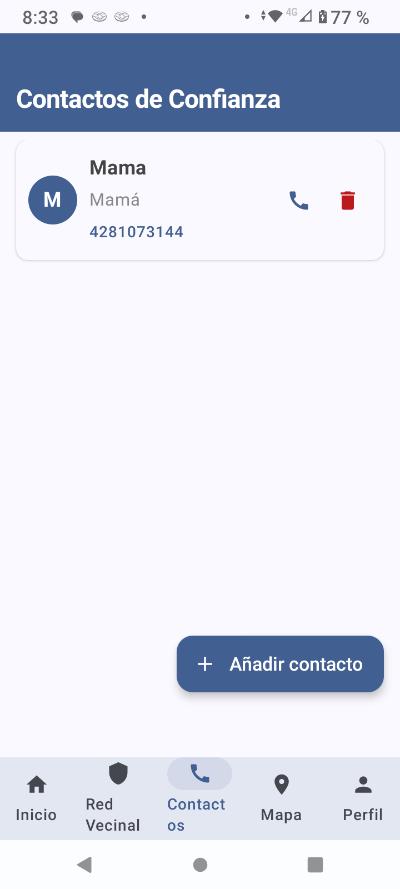

### 3.5. Escáner de Código QR
La app cuenta con un lector de cámara embebido para invitar a vecinos o vincular la cuenta a una Smart TV.
- Analiza códigos generados por el mismo ecosistema.
- Procesa el ID de vinculación al vuelo.
- **Imagen de Referencia**:
  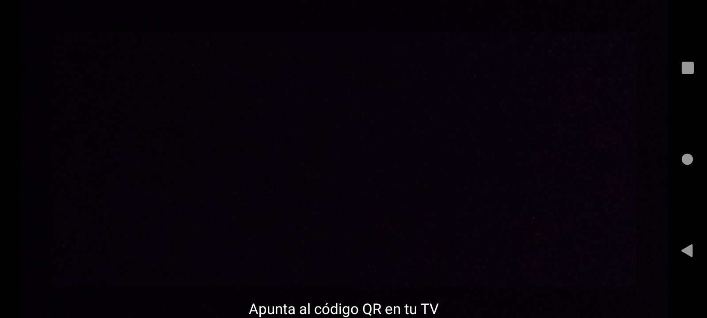

---

## 4. Configuración de Dispositivos (Watch & TV)

Para ofrecer una experiencia IoT completa, Cuna Segura permite la vinculación con hardware adicional. Estos menús se encuentran en la pestaña de "Perfil".

### 4.1. Mi Perfil y Vinculaciones
Esta pantalla agrupa los ajustes del usuario, su avatar, datos personales y el hub de "Dispositivos Vinculados y Toques".
- **SmartWatch BLE**: Botón para configurar gestos físicos.
- **Smart TV Vecinal**: Botón para configurar la pantalla donde se proyectarán las alertas.
- **Red Vecinal**: Acceso para salir de la red o administrarla (si se tiene permiso).
- **Imagen de Referencia**:
  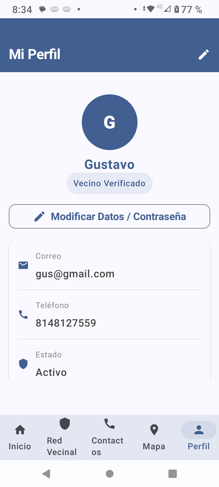
  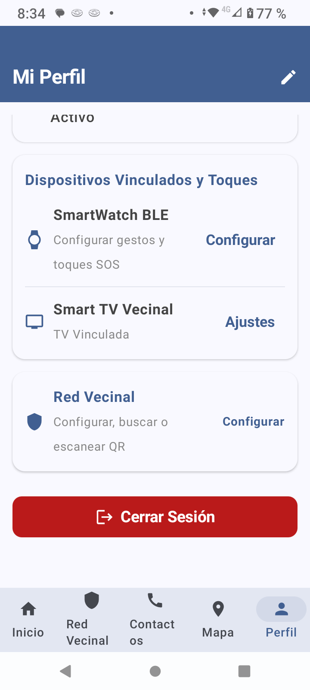

### 4.2. Configuración del SmartWatch (Wear OS)
La comunicación se realiza vía Bluetooth Low Energy (Wearable Data Layer API).
- El usuario asocia acciones específicas dependiendo del número de toques físicos que haga en el botón de su smartwatch.
  - **1 toque**: Ejemplo: "Activar alarma en TV de vecinos".
  - **2 toques**: Ejemplo: "Compartir ubicación en tiempo real".
  - **3 toques**: Ejemplo: "Llamar al 911".
  - **4 toques**: Ejemplo: "Enviar mensaje de alerta".
- Al darle a "Guardar Configuración", los datos se actualizan en Firebase, Room, y se envían en un Data Payload (`/cunasegura/config/update`) directo al reloj conectado.
- Adicionalmente, el reloj pide automáticamente esta configuración al abrir su aplicación mediante una petición de sincronización (`sync_request`).
- **Imagen de Referencia**:
  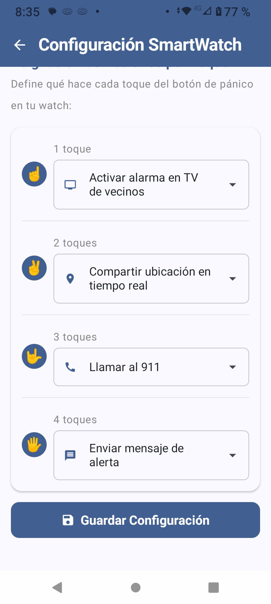

### 4.3. Configuración de la Smart TV
Permite activar la "Central de Monitoreo" en un televisor Android TV.
- Si no está vinculado, muestra instrucciones y un botón para abrir la cámara ("Escanear QR de la TV").
- Muestra el ID de vinculación actual.
- Informa sobre las características: recibir alertas visuales, mapa de SOS y datos de contacto de las víctimas.
- **Imagen de Referencia**:
  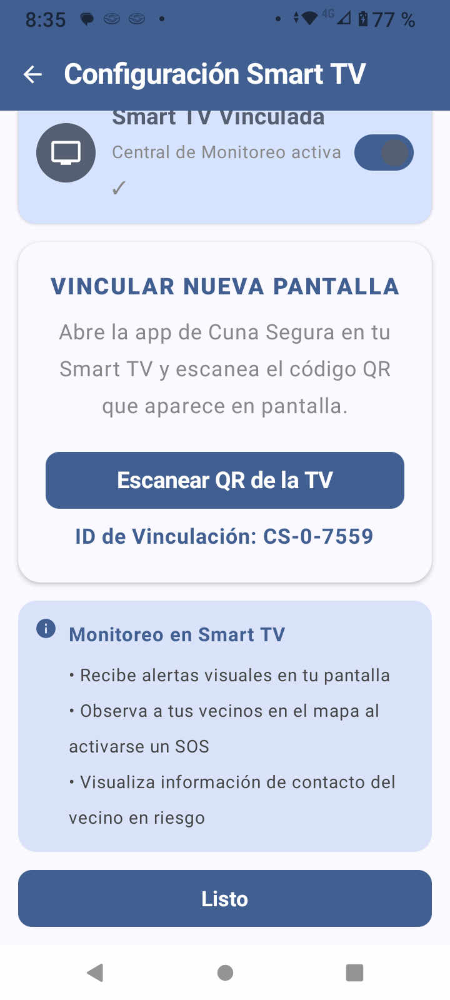

---

## 5. Flujo del Administrador de Red Vecinal (Admin de Colonia)

Ciertos usuarios tienen permisos elevados locales ("Admin de Red"). Estos usuarios moderan su colonia específica.

### 5.1. Dashboard de Administración Vecinal
Similar a la vista del usuario, pero con controles avanzados.
- Aparece la etiqueta **"Admin de Red"**.
- El admin puede ver el **Código QR para invitar vecinos** de forma destacada, usado para reclutamiento rápido.
- **Imagen de Referencia**:
  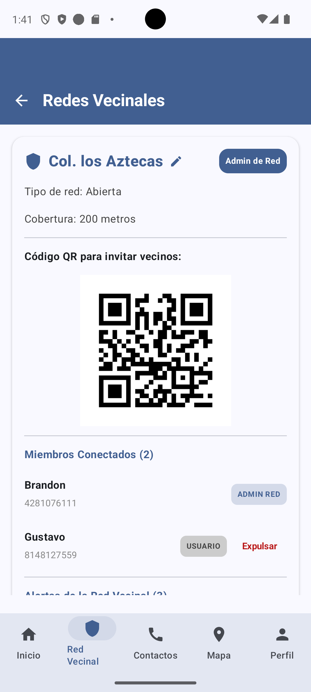

### 5.2. Edición y Gestión de la Red
- Al presionar el icono de lápiz, el administrador de la red puede cambiar el "Nombre de la Red" (Ej. de "Col. los Aztecas" a "Col. Centro").
- Desde la lista de "Miembros Conectados", el admin puede seleccionar usuarios normales y presionar **"Expulsar"** si están haciendo mal uso de la red.
- **Imagen de Referencia**:
  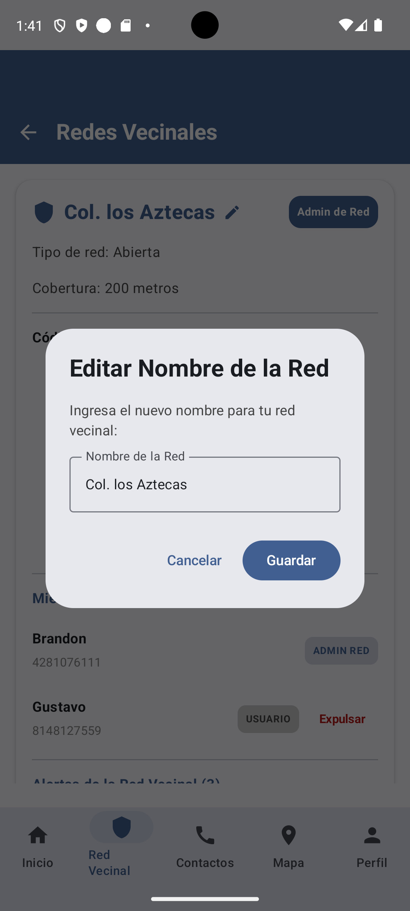

### 5.3. Gestión de Alertas y Cancelaciones
- Existe una sección de "Alertas de la Red Vecinal" donde el admin ve un historial en vivo de alertas disparadas.
- Cada alerta muestra qué usuario la detonó y sus coordenadas (Ubicación: lat, lng).
- El admin tiene el poder de marcar alertas como **"CANCELADA"** o "ATENDIDA" para limpiar el mapa comunitario.
- También se cuenta con un botón rojo (Danger) para "Salir de la Red Vecinal".
- **Imagen de Referencia**:
  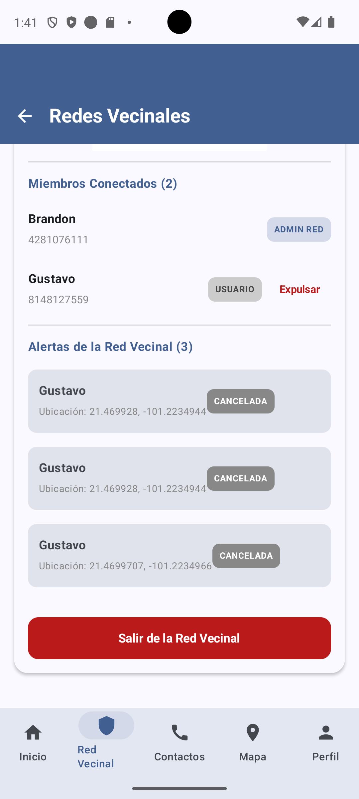

---

## 6. Flujo del Administrador Global

El nivel más alto de permisos. Este usuario gestiona todas las colonias, configuraciones macro del sistema y vigila el desempeño de los servicios (Firebase, Push, Wearable).

### 6.1. Resumen de Estado (Dashboard Global)
Vista inicial exclusiva para administradores globales.
- Etiqueta clara de "Administrador Global".
- **Estadísticas de la Red**: Resumen rápido de usuarios totales, activos, y módulos (ej. 3 Vecinos, 3 Activos, 7 Total).
- **Módulos en Desarrollo / Salud del Sistema**: Un panel que lista el estado de integración de las diferentes tecnologías de Cuna Segura:
  - Firebase Realtime DB (Alertas en tiempo real).
  - FCM Push (Notificaciones).
  - Smart TV App (Monitoreo).
  - BLE Smartwatch (Comunicación Bluetooth).
- **Imagen de Referencia**:
  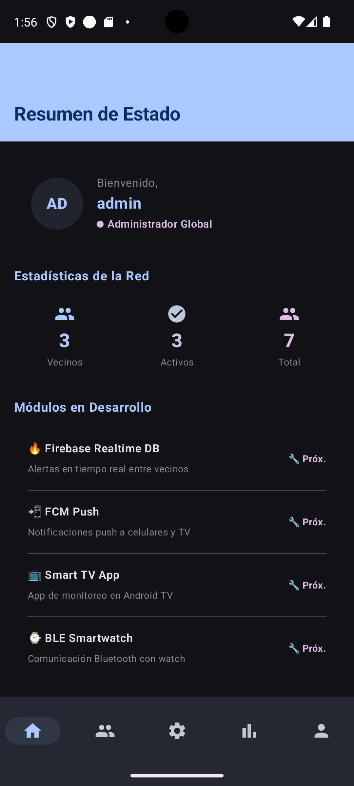

### 6.2. Gestión Global de Miembros
Pestaña de administración de cuentas a nivel macro.
- Permite ver un listado completo de todos los usuarios registrados en el sistema, independiente de su colonia.
- Controles directos para **"Bloquear"** a un usuario de manera definitiva (ban), prohibiéndole el inicio de sesión.
- Pestaña secundaria para "Solicitudes" pendientes de aprobación.
- Muestra el rol, teléfono, correo e ID de cada individuo.
- **Imagen de Referencia**:
  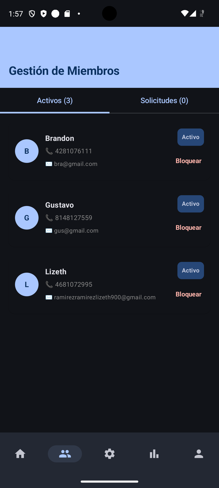

### 6.3. Configuración de la Red (Ajustes Globales y Políticas)
El administrador global parametriza las reglas duras del sistema mediante controles de precisión (sliders).
- **Tipo de Red**: Abierta (Basada en GPS) o Cerrada (Solo invitación QR).
- **Radio Máximo de Cobertura**: Limita qué tan lejos se envían las notificaciones a vecinos (Ej. 200m).
- **Tiempo anti-falsas alarmas**: Segundos que se debe mantener presionado el botón (Ej. 5s).
- **Check de vida cada**: Cada cuánto el sistema hace 'ping' a los dispositivos para saber que siguen conectados (Ej. 1 min). Este valor se sincroniza dinámicamente con los relojes vinculados.
- **Espera para nuevos miembros**: Días de enfriamiento ("cooldown") para que cuentas recién creadas puedan enviar un SOS (evita spam de bots o trolls).
- **Tiempo vida de alerta (Global)**: Duración en la que un SOS sigue mostrándose en el mapa antes de auto-descartarse (Ej. 96 hrs).
- **Imágenes de Referencia**:
  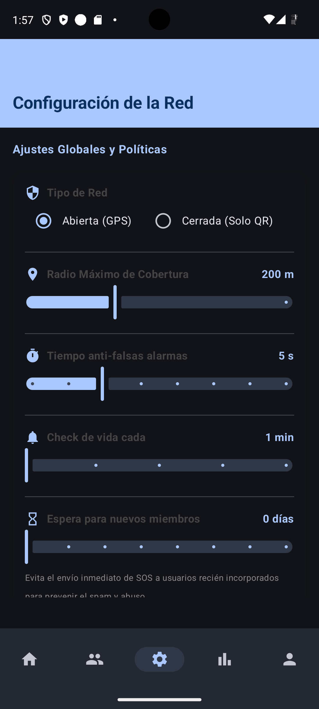
  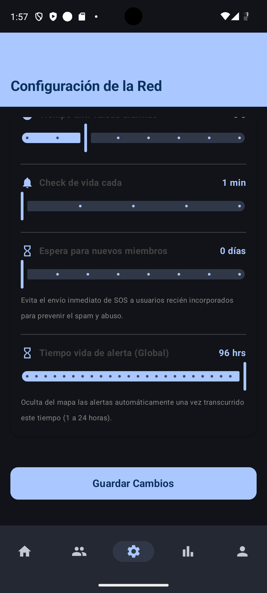

### 6.4. Historial y Estadísticas
Panel analítico para medir la efectividad de la aplicación comunitaria.
- **Métricas Semanales**: Diferenciador entre "Alertas Totales", "Alertas Reales" y "% de Falsas alarmas".
- **Gráficos de Distribución por Día**: Gráfico de líneas o barras comparando la cantidad de emergencias ocurridas en la semana.
- **Registro de Auditoría Reciente**: Lista los administradores que han marcado alertas como "Real/Atendida", mostrando el timestamp exacto para mantener un rastro transparente de quién canceló qué alerta.
- **Imágenes de Referencia**:
  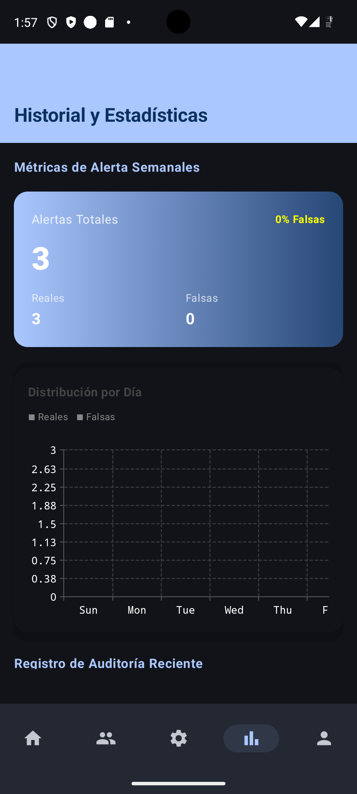
  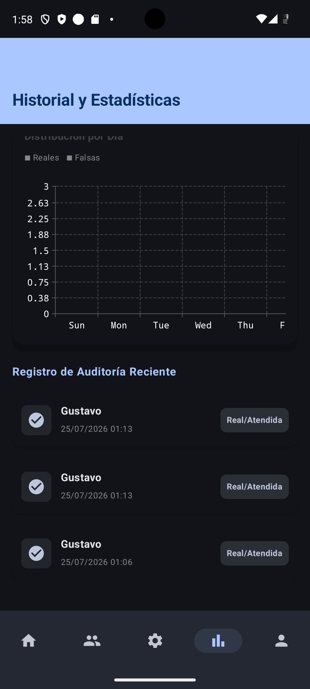

---

## 7. Arquitectura del Código e Implementación Técnica

### 7.1. Patrón MVVM y Clean Architecture
El código de la aplicación móvil está estructurado utilizando el patrón **Model-View-ViewModel (MVVM)**, combinado con principios de **Clean Architecture**.
- **Capa de Presentación (UI)**: Construida 100% con Jetpack Compose. Utiliza un tema basado en Material 3 (`CunaSeguraTheme`) que define paletas de color en modo oscuro profundo y tipografías consistentes.
- **Capa de Dominio**: Contiene los `UseCases` y las interfaces de los repositorios, abstrayendo la lógica de negocio pura (ej. Validar registro, calcular cercanía por GPS).
- **Capa de Datos**: Implementa las llamadas a la base de datos local (Room) y a la red (Firebase Realtime Database / API de Autenticación).

### 7.2. Base de Datos Local (Room)
Se diseñó un esquema relacional para mantener el funcionamiento offline y servir de caché rápida:
1. **Tabla `usuarios`**: Almacena sesión activa, token, nombre, teléfono, rol (`VECINO`, `ADMIN_COLONIA`, `ADMIN_GLOBAL`).
2. **Tabla `contactos_confianza`**: Relación 1:N. IDs, nombres, teléfonos.
3. **Tabla `configuraciones_toques`**: Relación 1:N. Almacena la acción definida para 1, 2, 3 y 4 toques por cada usuario individual.

### 7.3. Base de Datos en la Nube (Firebase)
- **Nodos Principales**:
  - `/usuarios`: Datos demográficos y roles distribuidos.
  - `/alertas_activas`: Coordenadas lat/lng, timestamp, senderId, y estado. Utilizado por los mapas de Android y Smart TV.
  - `/configuracion_toques/{uid}`: Copia en la nube de la configuración de Room, asegurando que si cambias de teléfono, tu reloj siga funcionando igual.
  - `/vinculaciones`: Mapeo de códigos QR escaneados entre un ID de TV y un UID de usuario.

### 7.4. Servicios en Segundo Plano y Sensores
- **Servicio de Localización Continua**: Un `ForegroundService` que solicita permisos `ACCESS_FINE_LOCATION` y `ACCESS_BACKGROUND_LOCATION` para poder registrar las coordenadas del usuario incluso si la app está cerrada, vital para la respuesta de emergencias.
- **PhoneWearableService**: Servicio escucha de las API de Wearable (`MessageClient`, `DataClient`).
  - Intercepta `/cunasegura/alert/trigger` enviado por el reloj.
  - Responde a solicitudes `/cunasegura/config/sync_request` desde el reloj, leyendo la base de datos local y respondiendo con un payload `T1|T2|T3|T4`.
- **FCM (Firebase Cloud Messaging)**: Usado para "despertar" los dispositivos de toda una colonia cuando alguien aprieta el botón SOS o se detectan gestos desde el reloj.

### 7.5. Permisos Críticos en AndroidManifest
Para el correcto funcionamiento, la aplicación requiere autorización explícita del usuario en tiempo de ejecución para:
- `android.permission.CAMERA`: Para el lector de códigos QR.
- `android.permission.ACCESS_FINE_LOCATION` / `COARSE_LOCATION`: Para mapas comunitarios.
- `android.permission.POST_NOTIFICATIONS`: Obligatorio en Android 13+ para emitir alertas sonoras de SOS.
- `android.permission.BLUETOOTH_CONNECT` / `BLUETOOTH_SCAN`: Necesario para descubrir y transferir datos a los smartwatches Wear OS cercanos.

---

## 8. Ejecución y Despliegue Local
Para correr el módulo `app` (Smartphone) en tu máquina local:
1. Asegúrate de tener Android Studio Hedgehog o superior.
2. Sincroniza Gradle y selecciona la configuración de compilación `app`.
3. Conecta un dispositivo físico Android (mínimo Android 8.0, recomendado Android 11+) vía USB Debugging o arranca un emulador.
4. (Opcional) Si quieres probar la integración BLE de reloj, necesitas un teléfono físico o emparejar dos instancias de emulador mediante la herramienta de Google (Wear OS emulator pairing).
5. Presiona el botón verde de "Run" o corre por terminal `./gradlew :app:assembleDebug`.
6. En caso de emulador de Google Maps, asegúrate de configurar tu clave API de Google Maps en `local.properties` (MAPS_API_KEY).

---

## 9. Conclusión de la Sección Móvil
El módulo Smartphone se establece como una pieza robusta de software que equilibra una extrema facilidad de uso en momentos de estrés (Botón SOS gigante) con características avanzadas de administración de hardware (vinculación TV/Watch) y gobernanza de la comunidad (paneles de administración vecinal y global). 
Su código en Compose garantiza un mantenimiento eficiente, y su integración bi-direccional con Firebase/WearOS lo posiciona como el cerebro de toda la plataforma de Cuna Segura.
