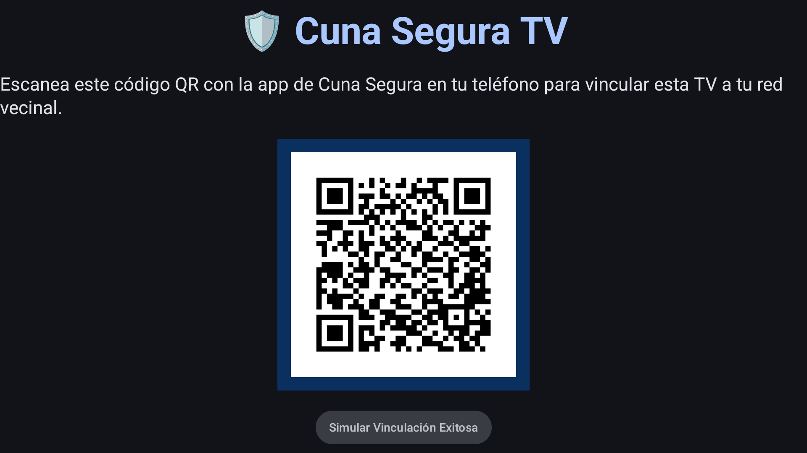
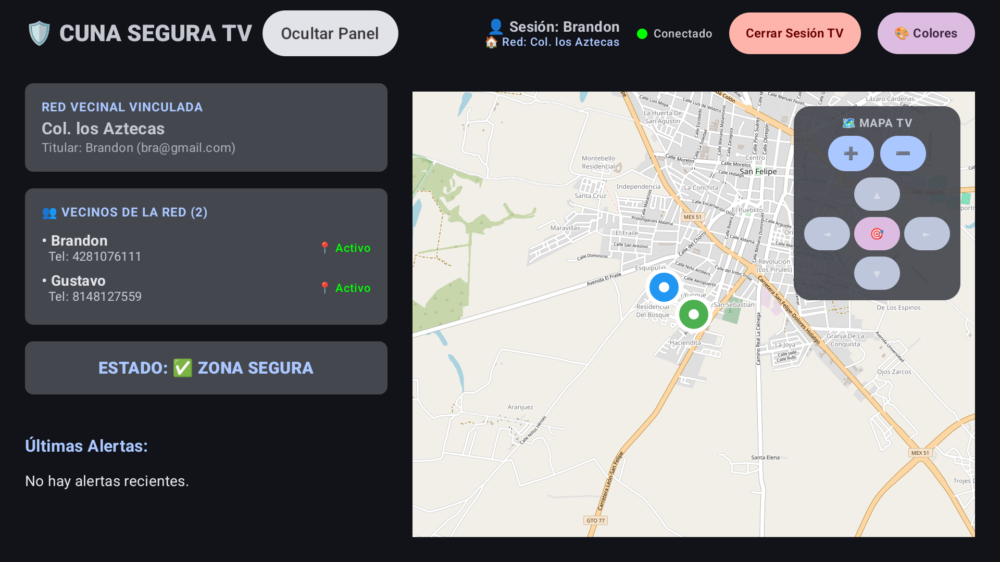
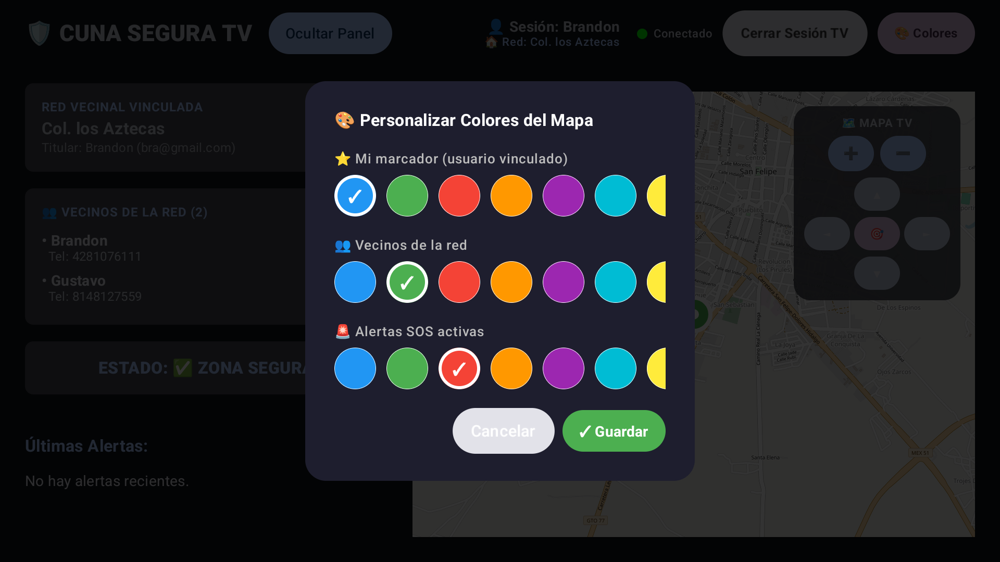
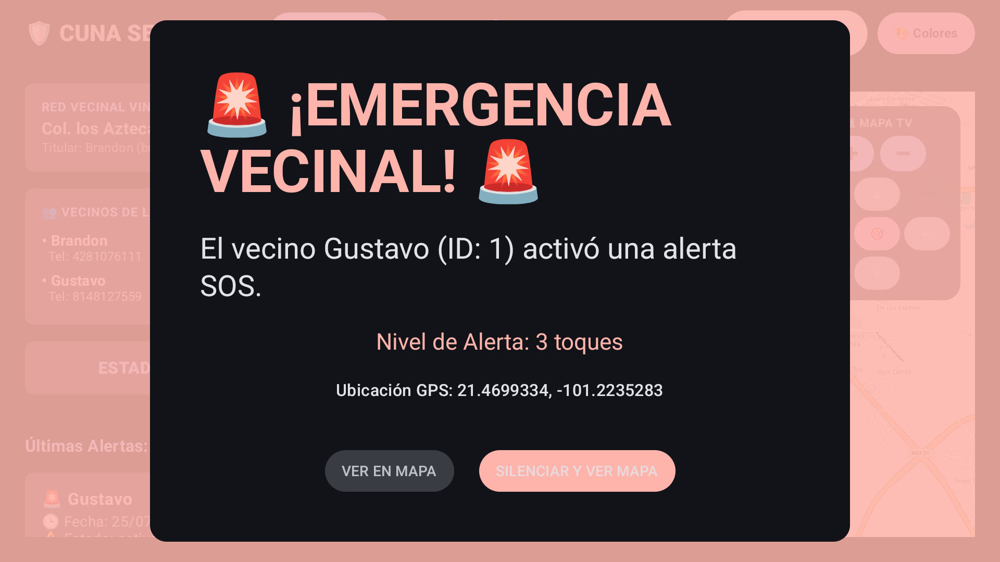
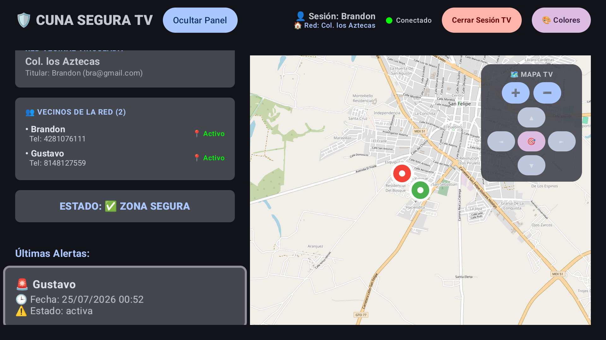

# 📺 Módulo TV (Smart TV Dashboard)

Diseñado específicamente para centros de monitoreo, casetas de vigilancia o simplemente como una central de visualización en pantallas grandes (1080p y 4K).

## Características Principales
- **Vista Cinemática (Dashboard)**: Interfaz estructurada para ser legible a la distancia con colores contrastantes y responsividad total mediante Leanback y Jetpack Compose for TV.
- **Panel Lateral Dinámico**: Ocupa el 40% de la pantalla para mostrar las alertas recientes y estados críticos. Completamente colapsable y animado para expandir el mapa al 100%.
- **Mapas de OSMDroid Optimizados**: El mapa interactivo ha sido calibrado con ciclos de vida y User-Agents específicos para Android TV, permitiendo visualizar los incidentes al instante sin cortes de red y navegable vía control remoto (D-Pad).
- **Alertas Claras**: Tarjetas grises/azules (`surfaceVariant`) que resaltan contra el fondo profundo para evitar confusiones y no perder de vista los eventos de la base de datos (MQTT/Firebase).
- **Sincronización en Tiempo Real**: Agrupación inteligente de alertas para mostrar siempre la más reciente por vecino, limpiando duplicados automáticamente.
- **Control Remoto Nativo**: Todos los elementos soportan navegación mediante la cruceta (D-Pad) del control remoto clásico.

## Pantallas y Funcionamiento

### 1. Inicio de Sesión y Vinculación (QR)
Al iniciar la aplicación por primera vez o al no tener una sesión activa, se despliega una pantalla con un código QR único. El usuario debe escanear este código utilizando la aplicación móvil de Cuna Segura para vincular la televisión directamente a su red vecinal de forma segura y sin necesidad de escribir contraseñas con el control remoto.

### 2. Dashboard Principal (Sin Alertas)
El panel principal de la televisión muestra en el lateral izquierdo la información de la red vecinal vinculada, su titular, y la lista de vecinos conectados en tiempo real. En el lado derecho se ubica el mapa de la zona con los marcadores de los vecinos.

### 3. Personalización de Colores
Dado que el mapa puede saturarse visualmente, la app cuenta con un panel emergente, 100% navegable con el control remoto, que permite seleccionar y guardar colores personalizados para:
- Tu propio marcador (El titular de la TV).
- Los marcadores de otros vecinos.
- Las alertas SOS detonadas.

### 4. Modal de Alerta Crítica (SOS)
En el instante en que un vecino (ya sea desde la App Móvil o desde el SmartWatch) detona una alerta de pánico, la televisión interrumpe la vista actual y despliega un modal gigante a pantalla completa con alarma sonora. Este modal muestra el nombre del vecino, el nivel de la alerta, sus coordenadas GPS, y proporciona botones para silenciar la alarma y ubicar inmediatamente el siniestro en el mapa.

### 5. Monitoreo de Alerta Activa en Mapa
Una vez descartado el modal crítico, el sistema enfoca automáticamente el mapa en la ubicación del incidente, dibujando un marcador distintivo para la alerta SOS (rojo por defecto) y añadiendo el registro oficial y agrupado al historial lateral de "Últimas Alertas".

## Ejecución
Para compilar y ejecutar este módulo desde Android Studio:
1. Cambia la configuración de ejecución a **`cunaseguratv`**.
2. Selecciona un emulador de Android TV (1080p) o conecta un Smart TV físico por ADB.
3. Presiona **▶ Run**.
