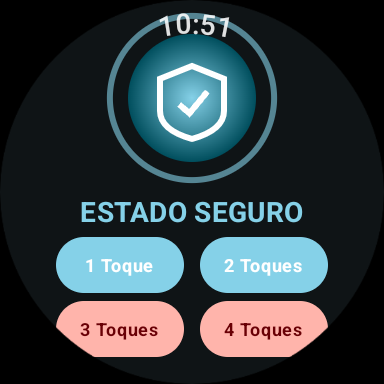
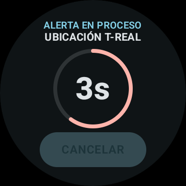
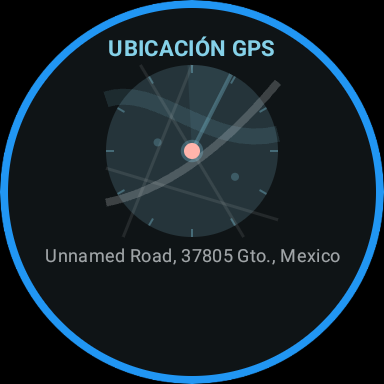

# ⌚ Módulo Wear OS (Smartwatch)

Este módulo contiene la aplicación diseñada para relojes inteligentes con **Wear OS**. Ofrece una interfaz premium, rápida y accesible para activar alarmas silenciosas y alertas de emergencia directamente desde la muñeca.

## Características Principales

1. **Base de Datos Local (Room)**
   - Almacena la configuración de acciones asociadas al número de toques físicos en el reloj (`TouchConfig`).
   - Se precarga automáticamente en el primer inicio de la app con las siguientes configuraciones por defecto:
     - **1 toque:** Enviar SMS de ayuda
     - **2 toques:** Compartir ubicación GPS
     - **3 toque:** Encender bocina de vecino
     - **4 toques:** Llamada de emergencia al 911

2. **Rastreo GPS en Tiempo Real**
   - Utiliza el sensor `GPS` nativo a través de `LocationManager` para rastrear las coordenadas del usuario durante un SOS activo.
   - Traduce las coordenadas de latitud/longitud a una dirección física legible (calle, número) de forma asíncrona usando `Geocoder`.

3. **Simulación de Toques Física y Segura**
   - Cuenta con una pantalla de cuenta regresiva de 5 segundos (`CountdownScreen`) con progreso circular dinámico que permite cancelar la alerta.

4. **Chequeo de Vida (Life Check)**
   - Interfaz con efecto *glassmorphism* que le pregunta al usuario "¿ESTÁS BIEN?" ante sospechas de incidentes, permitiendo responder de forma ergonómica en la pantalla táctil.

## Capturas de Pantalla

> Capturas tomadas en el emulador **Wear OS (384×384)** con la app en ejecución real.

| Pantalla | Descripción |
|---|---|
|  | **Estado Seguro** — Pantalla principal con los 4 botones de acción |
|  | **Cuenta Regresiva** — 5 segundos para cancelar (acción 3 toques) |
|  | **Ubicación GPS** — Mapa con dirección en tiempo real (alerta activa) |
|  | **Compartiendo GPS** — Transmisión de ubicación a contactos |

## Compilación e Instalación

Para compilar y empaquetar el módulo de Wear OS de forma independiente:

```powershell
# Compilar APK de desarrollo para el reloj
.\gradlew :cunasegurawear:assembleDebug

# Instalar APK en el dispositivo (reloj o emulador conectado)
.\gradlew :cunasegurawear:installDebug
```
